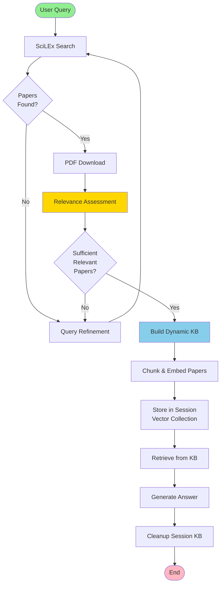
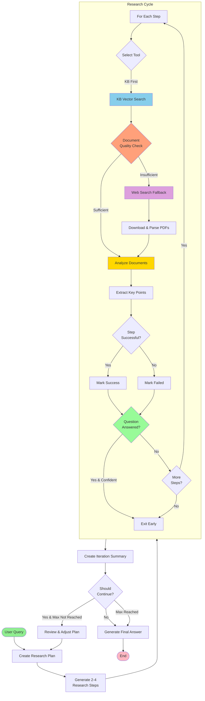
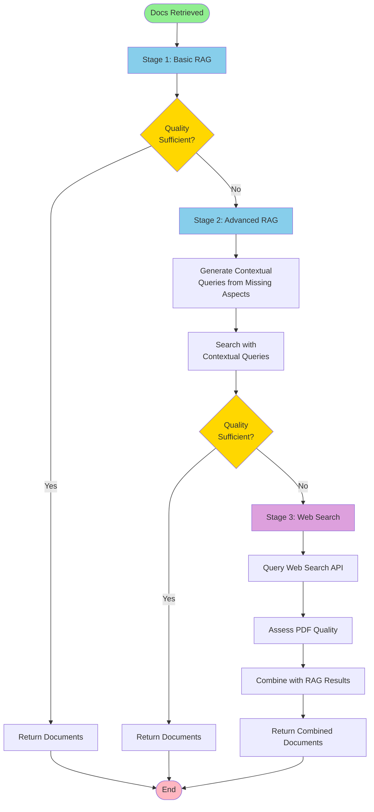
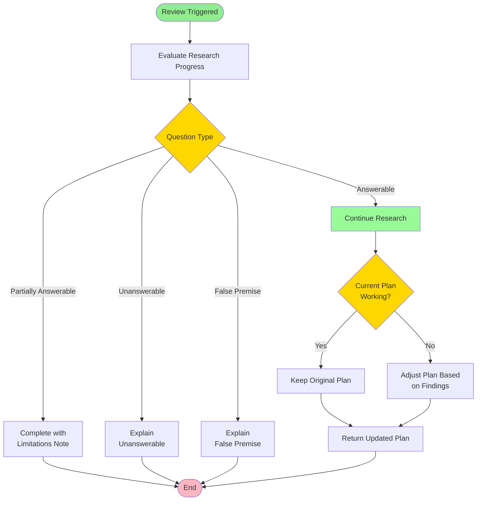
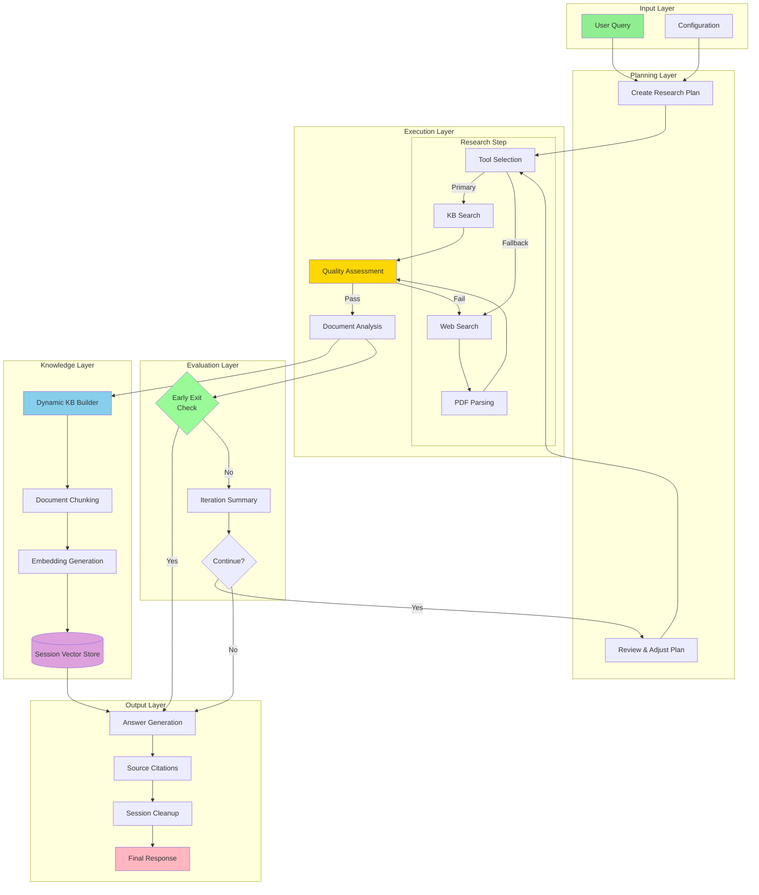

# Dynamic KB & Agentic RAG Workflow Flowcharts

## Flowchart 1: High-Level Dynamic KB Building Workflow

## Flowchart 2: Detailed Agentic RAG Workflow

## Flowchart 3: Document Quality Assessment (Sub-process)

## Flowchart 4: Plan Review & Adjustment (Sub-process)

## Flowchart 5: Complete System Architecture

## Legend

| Color | Meaning |
|-------|---------|
| 🟢 Green | Start/End points |
| 🔵 Blue | Primary process steps |
| 🟡 Yellow | Decision/Assessment points |
| 🟣 Purple | External services (Web, Vector DB) |
| 🟠 Orange | Sub-process calls |
| 🔴 Pink | Output/Result |

## Key Workflow Features

### 1. **Dynamic KB Building**
- Session-scoped vector collections
- Automatic chunking and embedding
- Cleanup after use

### 2. **Agentic Capabilities**
- **Document Quality Assessment**: 3-stage retrieval (Basic → Advanced → Web)
- **Early Exit**: Stops when question is confidently answered
- **Tool Selection**: Intelligent choice between KB and web search
- **Plan Adjustment**: Dynamic strategy modification based on findings

### 3. **Iterative Research**
- Multiple research cycles
- Plan refinement between cycles
- Progress evaluation at each step

### 4. **Graceful Degradation**
- Web search fallback when KB insufficient
- Query refinement when no results
- Clear explanations for unanswerable questions
